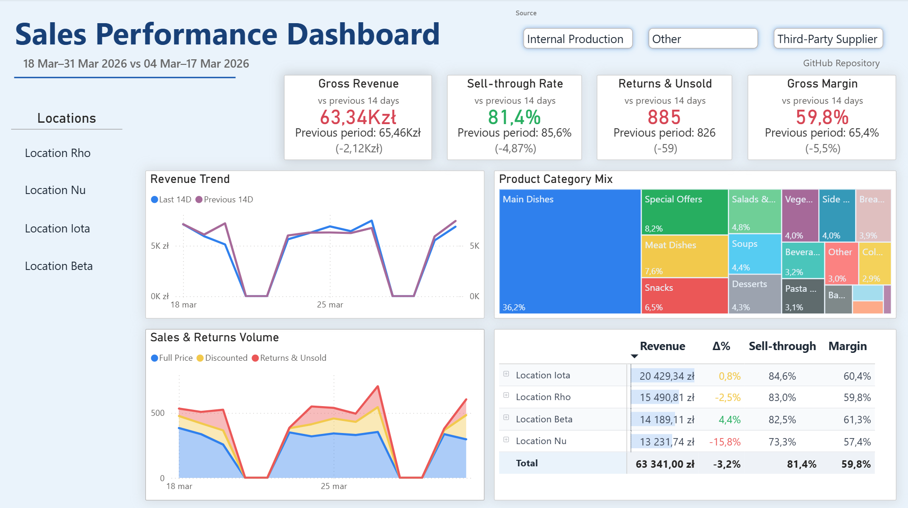
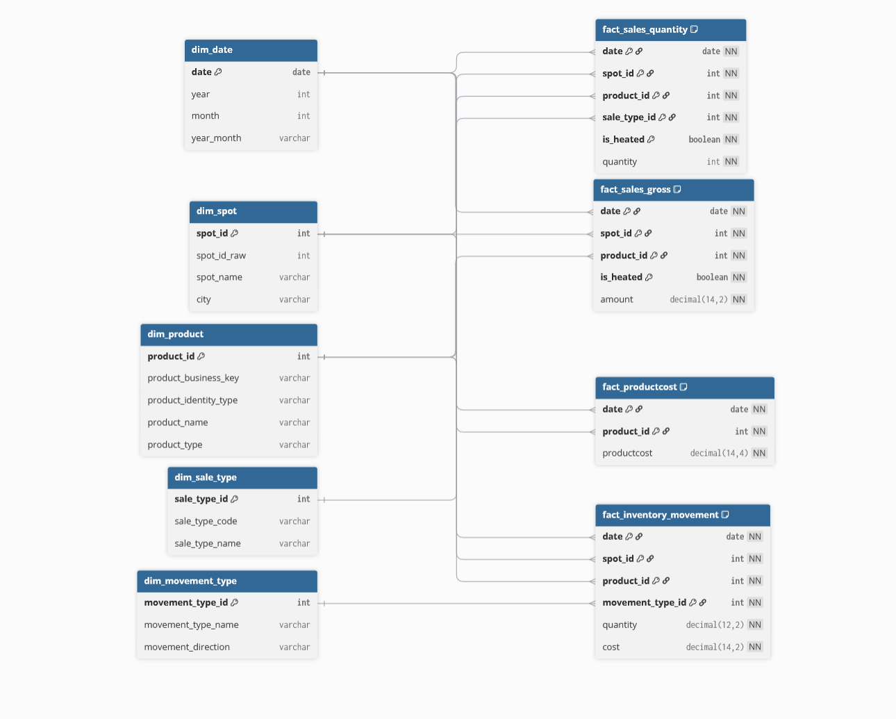

# Sales Data Pipeline (Excel → Analytical Model)

## Overview

This project builds a complete data pipeline that transforms messy daily Excel reports into a structured analytical data model (dimensions + facts).

It is designed for real operational data where:

- reports are inconsistent
- product identifiers are unstable or missing
- data quality issues are common

The output is ready for reporting (Power BI) and operational analysis.

---

## Power BI Dashboard

Example dashboard built on top of the analytical model:



Live dashboard: [Open interactive Power BI report](https://app.powerbi.com/view?r=eyJrIjoiZDY5NGMzMmEtN2U3NS00ZjkxLTlkMmYtMmEyMTNmM2MwNDhjIiwidCI6IjM4MmY1YTE3LWJlNzgtNDUwZS1iYzc0LTFmNDVkNjgyYWU0ZCJ9)

The dashboard demonstrates:

- operational sales monitoring
- 14-day period-over-period comparison
- sell-through analysis
- revenue and margin tracking
- product category mix analysis
- returns and unsold inventory monitoring

The Power BI layer is built directly on CSV outputs generated by the pipeline.

---

## Problem

Daily sales data comes from multiple Excel files:

- multiple sheets per file (per sales point)
- inconsistent product names and codes
- no stable product identifiers
- partial data errors (missing values, duplicates, conflicts)

Manual processing is:

- time-consuming
- error-prone
- not scalable

---

## Solution

The pipeline:
Excel → Extract → Raw → Staging → Dimensional Model → CSV Output → Power BI

Transforms raw data into a consistent analytical model while:

- preserving traceability
- validating data quality
- exposing inconsistencies instead of hiding them

This approach reflects real-world data challenges typically found in operational systems rather than clean, curated datasets.

---

## Simplified Data Model

Below is a simplified view of the analytical model used in the project.

It presents the core business structure of the solution and intentionally omits some technical keys and processing-support columns to keep the diagram easy to read.



---

## What this project demonstrates

- working with **messy real-world operational data**
- designing a **layered data pipeline (ETL/ELT)**
- building a **dimensional model (facts + dimensions)**
- handling **missing identifiers and entity resolution**
- implementing **data validation and error handling**
- separating **business logic (JSON) from code**

---

## Business Context

The project reflects operational reporting scenarios commonly found in:

- retail
- food production
- multi-location sales operations
- inventory-driven businesses

The analytical model supports monitoring of:

- revenue trends
- sell-through efficiency
- discount sales
- inventory returns
- unsold products
- product category performance
- gross margin

The dashboard focuses on operational decision support rather than executive-only KPI presentation.

---

## Pipeline Architecture

### Extract

- reads multiple Excel files and sheets
- identifies sales points using `#spot_id`
- attaches technical metadata:
  - source_file
  - source_sheet
  - report_date_raw
  - spot_id_raw
  - load_timestamp

### Raw

- stores unmodified extracted data
- serves as a debugging reference point
- no business logic applied

### Staging

- normalizes structure and data types
- parses dates and numeric values
- maps entities using JSON configuration
- validates sales consistency
- adds data quality flags

### Product Identity

Handles lack of stable product identifiers:

- `RECIPE` – based on internal recipe number
- `NAME_MATCH` – based on normalized name
- `TEMPORARY` – fallback for unresolved cases

Supports:

- multiple names per product
- group conflicts
- inconsistent source data

### Dimensions

- `dim_date`
- `dim_spot`
- `dim_sale_type`
- `dim_movement_type`
- `dim_product`

Features:

- technical surrogate keys
- business keys (e.g. `product_business_key`)
- configuration-driven logic (JSON)

### Facts

- `fact_sales_quantity`
- `fact_sales_gross`
- `fact_productcost`
- `fact_inventory_movement`

Features:

- consistent grain
- separation of quantity and value
- full linkage to dimensions

---

## Data Output

### Analytical tables

Location: `data/output/`

- one CSV per table
- ready for Power BI / BI tools

### Debug outputs

Location: `data/temp/`

- intermediate Excel exports
- used for validation and troubleshooting

---

## Data Quality Approach

The pipeline is designed to **expose data issues**, not hide them.

Handled cases:

- inconsistent product names
- missing identifiers
- conflicting product costs
- partial or invalid records

Strategy:

- fail fast for critical errors
- warnings for recoverable issues
- full traceability to source

---

## Tech Stack

- Python
- Pandas
- JSON (business logic configuration)
- Excel (source data)
- Power BI (target usage)

---

## How to run

```bash
pip install -e .
create-database
```

---

## Power BI Integration

The analytical model is consumed in Power BI using CSV outputs from the pipeline.

To ensure portability across environments, Power BI uses a **configurable base path parameter** instead of hardcoded file paths.

### Approach

- a `BasePath` parameter defines the root project directory
- all data sources are loaded using relative paths:
  `File.Contents(BasePath & "data/output/csv/dim_date.csv")`

### Benefits

- no need to modify queries when moving the project
- easier setup on different machines
- cleaner and more maintainable data connections

---

## Dashboard Features

The Power BI dashboard includes:

### KPI Monitoring

- Gross Revenue
- Sell-through Rate
- Returns & Unsold Inventory
- Gross Margin

### Trend Analysis

- current vs previous 14-day revenue comparison
- sales and returns volume tracking

### Product Analysis

- category revenue mix
- operational performance by sales point
- expandable matrix with category drilldown

### Business Logic

The dashboard includes custom business rules, including:

- exclusion of specific sale types from operational sales KPIs
- sell-through threshold classification
- operational interpretation of unsold inventory
- configurable movement type handling

---

## Project Structure

- `extract/` – reading Excel files
- `raw/` – raw data layer
- `staging/` – data cleaning and validation
- `dimensions/` – dimension tables
- `facts/` – fact tables
- `json/` – business logic (JSON)
- `orchestration/` – pipeline execution
- `utils/` – helper functions

---

## Key Design Decisions

- do not trust source data
- separate identity resolution from dimensions
- keep business logic outside code (JSON)
- store raw data for reproducibility
- make data issues visible
